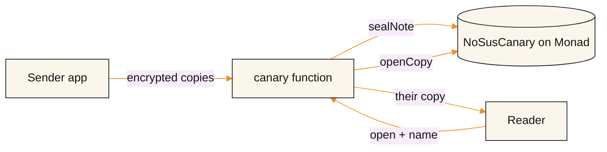

<!-- Generated by tool/build-readme.mjs: edit readme.config.json and re-run instead of editing this file. -->

<p align="center">
  <a href="http://shubham-sahu.me/nosus-canary/"></a>
</p>

<p align="center">
  <a href="http://shubham-sahu.me/nosus-canary/"></a>
  &nbsp;
  <a href="#judge-checklist"></a>
</p>

<p align="center"></p>

## Step 1: Watch

<p align="center"></p>

## Step 2: Try it

**60 seconds. No wallet. No install.**

1. **Make a note.** Open the [live app](http://shubham-sahu.me/nosus-canary/) → **PLAY CANARY** → **Create a Canary link** → **Use the demo note** → **Create Canary link**.
2. **Be a reader.** Open that link in a private window, type any name, tap **Open my copy**.
3. **Catch the leak.** Copy the reader's text → **Check a leak** → paste. It names the reader.

<p align="center"></p>

## Step 3: Why Monad

- **One transaction per reader.** Every **Open my copy** is recorded on-chain.
- **Final in under a second.** About **0.015 MON** each.
- **Parallel execution.** A whole room can open the link at once.

## Judge checklist

| | What | Where |
|---|---|---|
| **Done** | Live app | [shubham-sahu.me/nosus-canary/](http://shubham-sahu.me/nosus-canary/) |
| **Done** | Contract on Monad testnet | [`0xb1a1858866122c84cf97861ca815fb070e010e68`](https://testnet.monadscan.com/address/0xb1a1858866122c84cf97861ca815fb070e010e68) |
| **Done** | Verified source code | [View verified source](https://sourcify.dev/server/repo-ui/10143/0xb1a1858866122c84cf97861ca815fb070e010e68) |
| **Done** | Live transaction in the demo | Every **Open my copy** tap |
| **Done** | Public repo you can run | [Run it yourself](#more) |
| Soon | Build in public | _soon_ · _soon_ · _soon_ |
| Soon | Bonus: Monad mainnet | _soon_ |
| **Done** | Bonus: custom domain | [shubham-sahu.me](http://shubham-sahu.me/nosus-canary/) |

> **Honest limits:** it names *whose copy* leaked, not *who shared it*. It doesn't stop screenshots. It makes them traceable.

## More

<details>
<summary><b>How the fingerprint works</b></summary>

- **Write once.** NO SUS swaps safe word twins (`don't` / `do not`, `five` / `5`) to make up to **100 copies**. Each looks normal, each is unique.
- **Seal it.** Copies are encrypted in your browser. The key lives only in the link's `#fragment`. `sealNote` puts one hash of all copies on Monad before anyone reads.
- **Share it.** Each reader gets the next unused copy. `openCopy` records it on Monad with an anonymous tag, never the name.
- **Catch it.** Paste a leak into **Check a leak**. Matching runs on your device. If too little text survived, it names nobody.
</details>

<details>
<summary><b>Run it yourself</b></summary>

You need Flutter 3.44+ and Node 22+.

```bash
git clone https://github.com/https-shubhamsahu/nosus-canary.git
cd nosus-canary

# App (web)
cd app
flutter pub get
flutter run -d chrome

# Contract
cd ../contracts
npm ci
npx hardhat test
```

Own backend and contract: see [`docs/canary/NOSUS_CANARY_BUILD_PLAN.md`](docs/canary/NOSUS_CANARY_BUILD_PLAN.md).
</details>

<details>
<summary><b>Architecture</b></summary>



- **Chain:** hashes and anonymous tags only.
- **Server:** encrypted copies it can't read.
- **Sender's device:** the key and every copy's fingerprint.
</details>

<details>
<summary><b>Test results</b></summary>

Fingerprint test harness, 15-slot demo note:

| Leak type | Right copy | Wrong copy |
|---|---|---|
| Full copy, marker removed | 300 / 300 | 0 |
| OCR-style (caps, no punctuation) | 300 / 300 | 0 |
| 2% random typos | 300 / 300 | 0 |
| Partial excerpts (30–70%) | named only when sure | 0 / 600 |
</details>

Full technical write-up (setup, deployment, contract and relayers): [`docs/TECHNICAL_README.md`](docs/TECHNICAL_README.md)

---

**Team:** Shubham Sahu · Built at **Monad Blitz Mumbai V4** · part of **NO SUS**

<p align="center"><a href="http://shubham-sahu.me/nosus-canary/"></a></p>
